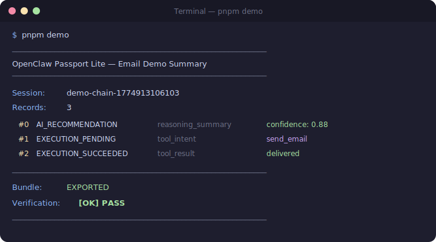

# Decision Passport: OpenClaw Lite

[](https://github.com/brigalss-a/decision-passport-openclaw-lite/actions/workflows/ci.yml)
[](LICENSE)

Decision Passport adds verifiable audit trails to OpenClaw.

Add a portable, append-only audit trail to every OpenClaw agent action. No database, no API dependency, offline verification included.

**TypeScript** · **OpenClaw compatible** · **Lite mode** · **No database** · **Offline verify** · **2 minute setup**

<p align="center">
  
</p>

---

## Install & run in 2 minutes

```bash
git clone https://github.com/brigalss-a/decision-passport-openclaw-lite.git
cd decision-passport-openclaw-lite
pnpm install --frozen-lockfile
pnpm demo
```

**Expected output (JSON, abbreviated):**

```json
{
  "result": { "success": true, "delivered_to": "client@example.com" },
  "bundle": {
    "bundle_version": "1.4-openclaw-lite",
    "passport_records": [
      { "sequence": 0, "action_type": "AI_RECOMMENDATION",    "actor_id": "openclaw-agent-01" },
      { "sequence": 1, "action_type": "EXECUTION_PENDING",    "actor_id": "openclaw-agent-01" },
      { "sequence": 2, "action_type": "EXECUTION_SUCCEEDED",  "actor_id": "openclaw-agent-01" }
    ],
    "manifest": { "record_count": 3, "chain_hash": "sha256:..." }
  },
  "verification": {
    "status": "PASS",
    "checks": [
      { "name": "chain_integrity",     "passed": true },
      { "name": "manifest_chain_hash", "passed": true }
    ]
  }
}
```

---

## What is this?

This package is the public Lite bridge between [OpenClaw](https://openclaw.ai) and the Decision Passport trust layer.

Every time an OpenClaw agent:
- produces a reasoning summary
- intends to call a tool
- returns a tool result

...this library stamps a cryptographically linked record into an append-only chain.

When the session ends, it exports a portable JSON bundle that anyone can verify offline, with no API and no database.

OpenClaw actions become traceable, exportable, and independently verifiable.

---

## Before / After

**Without this library:**
```
OpenClaw agent → calls tools → returns results → nothing recorded
→ Can you prove what the agent decided? No.
→ Can you explain what tools ran and why? No.
→ Can you give an auditor a bundle? No.
```

**With this library:**
```
OpenClaw agent → every reasoning + tool call stamped into chain
→ Bundle exported
→ Verifier: PASS ✓
→ Full chain: reasoning → intent → result
```

---

## Integration: 3 patterns

### Pattern 1: Wrapper (recommended)

Wrap your OpenClaw agent with `OpenClawPassportWrapperLite`. Explicitly record each event.

```typescript
import { OpenClawPassportWrapperLite } from 'decision-passport-openclaw-lite';

const passport = new OpenClawPassportWrapperLite({
  chainId: `session-${Date.now()}`,
  actorId: 'my-openclaw-agent',
  purpose: 'CUSTOMER_EMAIL_RESPONSE',
  model: 'claude-4'
});

// Before the agent acts, record the reasoning
await passport.recordReasoningSummary(
  'Customer inquiry about delayed order. Policy: respond within 24h.',
  0.91
);

// Before a tool call, record the intent
await passport.recordToolIntent('send_email', {
  to: 'customer@example.com',
  subject: 'Your order update'
});

// After the tool call, record the result
await passport.recordToolResultSummary('send_email', {
  success: true,
  delivered_to: 'customer@example.com'
});

// Finalise and export
const bundle = await passport.finalize('Session completed successfully');
```

---

### Pattern 2: Middleware (automatic intercept)

Use `OpenClawPassportMiddlewareLite` to intercept tool calls automatically.

```typescript
import { OpenClawPassportWrapperLite, OpenClawPassportMiddlewareLite } from 'decision-passport-openclaw-lite';

const wrapper = new OpenClawPassportWrapperLite({ chainId: 'chain-001', actorId: 'agent-01', purpose: 'DEMO' });
const middleware = new OpenClawPassportMiddlewareLite(wrapper);

// Before tool call
const toolCall = await middleware.beforeToolCall({
  tool: 'search_web',
  payload: { query: 'latest AI research' }
});

// Run your actual tool...
const result = await myTool(toolCall.payload);

// After tool result
await middleware.afterToolResult(toolCall, result);

// Bundle and verify
const bundle = await middleware.finalize('Search session complete');
const verification = verifyLiteBundle(bundle);
console.log(verification.status); // PASS
```

---

### Pattern 3: Minimal (just the chain)

Use the chain primitives directly for custom integrations.

```typescript
import { createRecord, createManifest, verifyChain } from 'decision-passport-openclaw-lite';

const records = [];
let lastRecord = null;

const r1 = createRecord({
  chainId: 'my-chain',
  lastRecord: null,
  actorId: 'agent-01',
  actorType: 'ai_agent',
  actionType: 'AI_RECOMMENDATION',
  payload: { summary: 'Proceeding with file operation', confidence: 0.88 }
});
records.push(r1);
lastRecord = r1;

// ... more records

const verification = verifyChain(records);
const manifest = createManifest(records);
```

---

## API reference

### `OpenClawPassportWrapperLite`

```typescript
new OpenClawPassportWrapperLite(config: {
  chainId: string;      // Unique session identifier
  actorId: string;      // Agent identifier
  purpose: string;      // Human-readable session purpose
  model?: string;       // Optional model name
})

.recordReasoningSummary(summary: string, confidence: number): Promise<PassportRecord>
.recordToolIntent(tool: string, payload: Record<string, unknown>): Promise<PassportRecord>
.recordToolResultSummary(tool: string, result: unknown): Promise<PassportRecord>
.finalize(summary?: string): Promise<LiteBundle>
```

### `OpenClawPassportMiddlewareLite`

```typescript
new OpenClawPassportMiddlewareLite(wrapper: OpenClawPassportWrapperLite)

.beforeToolCall(params: { tool: string; payload: Record<string, unknown> }): Promise<ToolCallContext>
.afterToolResult(context: ToolCallContext, result: unknown): Promise<PassportRecord>
.finalize(summary?: string): Promise<LiteBundle>
```

### `verifyLiteBundle`

```typescript
verifyLiteBundle(bundle: LiteBundle): { valid: boolean; status: 'PASS' | 'FAIL'; error?: string }
```

### `renderLiteHtmlReport`

```typescript
renderLiteHtmlReport(data: {
  bundle: LiteBundle;
  verification: { status: string; checks: { name: string; passed: boolean; message?: string }[] };
  generatedAt: string;
}): string   // self-contained HTML document
```

---

## Bundle format

Exported bundles are portable JSON:

```json
{
  "bundle_version": "1.4-openclaw-lite",
  "exported_at_utc": "2026-01-15T14:32:00.000Z",
  "summary": "Email session completed",
  "passport_records": [
    {
      "id": "uuid-...",
      "chain_id": "session-1748000000000",
      "sequence": 0,
      "timestamp_utc": "2026-01-15T14:31:58.000Z",
      "actor_id": "openclaw-agent-01",
      "actor_type": "ai_agent",
      "action_type": "AI_RECOMMENDATION",
      "payload": { "summary": "...", "confidence": 0.91, "type": "reasoning_summary" },
      "payload_hash": "sha256:...",
      "prev_hash": "GENESIS_00000...",
      "record_hash": "sha256:..."
    }
  ],
  "manifest": {
    "chain_id": "session-1748000000000",
    "record_count": 3,
    "first_record_id": "uuid-...",
    "last_record_id": "uuid-...",
    "chain_hash": "sha256:..."
  }
}
```

---

## HTML report export

Generate a self-contained HTML verification report from any bundle:

```typescript
import { verifyLiteBundle, renderLiteHtmlReport } from 'decision-passport-openclaw-lite';

const verification = verifyLiteBundle(bundle);
const html = renderLiteHtmlReport({
  bundle,
  verification,
  generatedAt: new Date().toISOString(),
});

// Write to file or serve directly. No external dependencies.
fs.writeFileSync('report.html', html);
```

The demo writes reports automatically to `artifacts/passport-lite-report.html`.

---

## Examples

Three ready-to-run demos included:

### Email demo
```bash
pnpm tsx examples/email-with-passport-lite/index.ts
```
Simulates: reasoning → send_email intent → delivery result → bundle → PASS → HTML report in `artifacts/`

### Browser action demo
```bash
pnpm tsx examples/browser-with-passport-lite/index.ts
```
Simulates: reasoning → navigate_browser → content extraction → bundle → PASS

### File operation demo
```bash
pnpm tsx examples/file-op-with-passport-lite/index.ts
```
Simulates: reasoning → read_file → write_file → bundle → PASS

---

## Lite vs Enterprise

| Capability | Lite (this repo) | Enterprise (private) |
|---|---|---|
| Reasoning summary recording | ✓ | ✓ |
| Tool intent recording | ✓ | ✓ |
| Tool result recording | ✓ | ✓ |
| Append-only chain | ✓ | ✓ |
| Bundle export (JSON) | ✓ | ✓ |
| Offline verifier | ✓ | ✓ |
| No database required | ✓ | ✓ |
| HTML verification report | ✓ | ✓ |
| Execution claims (single-use auth) | — | ✓ |
| Guard enforcement (blocking) | — | ✓ |
| Replay protection | — | ✓ |
| Outcome binding | — | ✓ |
| PostgreSQL persistence | — | ✓ |
| Redis locking | — | ✓ |
| Live dashboard | — | ✓ |
| Additional runtime bridges | — | ✓ |

---

## Commercial paths

Lite is free and open source.

Hosted, business, enterprise, and sovereign deployment options are available on request.

Contact: [contact@bespea.com](mailto:contact@bespea.com)

---

## Contributing

Apache-2.0. Contributions are welcome.

Fork the repository on GitHub, then run:

```bash
git clone https://github.com/YOUR_USERNAME/decision-passport-openclaw-lite.git
cd decision-passport-openclaw-lite
git checkout -b feat/my-improvement
pnpm install --frozen-lockfile
pnpm test
```

Then open a pull request.

---

## License

Apache-2.0

Copyright © 2025-2026 Bespoke Champions League Ltd
London, United Kingdom

Maintained by Grigore-Andrei Traistaru
Founder, Bespea / Bespoke Champions League Ltd

contact@bespea.com
https://bespea.com
